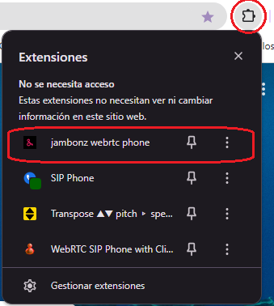
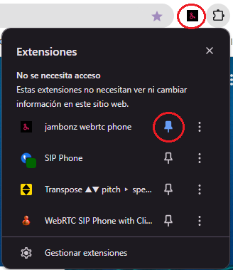
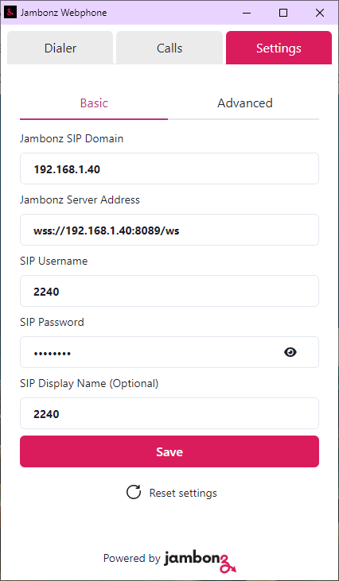
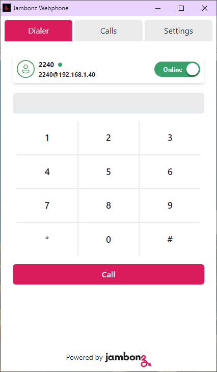

# Jambonz Webrtc Chrome extension dialer 

El Jambonz WebRTC Chrome Extension Dialer es una extensión de navegador fácil de usar que permite una comunicación WebRTC perfecta. Con esta extensión, los usuarios pueden iniciar llamadas de voz directamente desde sus navegadores web sin necesidad de software o hardware adicionales. Aprovecha las capacidades de plataforma de código abierto de Jambonz para manejar la comunicación VoIP con alta calidad y fiabilidad. Esta extensión es perfecta para aquellos que requieren comunicaciones en línea frecuentes, ofreciendo una experiencia aerodinácica con características de marcación rápida.

## Overview of the extension

<p float="left">
  
  
  
</p>

## How to build and install
## Cómo construir e instalar

### Construir

```
git clone https://github.com/jambonz/chrome-extension-dialer.git
cd chrome-extension-dialer
npm install
npm run build
```

### Install

- Open Chrome/Egde
- Open Extensions --> Manage Extensions
- Choose Load Unpacked
- Browse to dist folder which is the result of npm run build command.

### Instalar (En español)

- Abrir Chrome/Egde
- Abrir Extensiones
- Gestionar extensiones
- Elija cargar descomprimida (busque la carpeta clonada y ya compilada a traves de npm run build)
- Seleccione la carpeta "dist" que se creo como resultado de ejecutar npm run build.

<p float="left">
  
  
  
    
</p>
